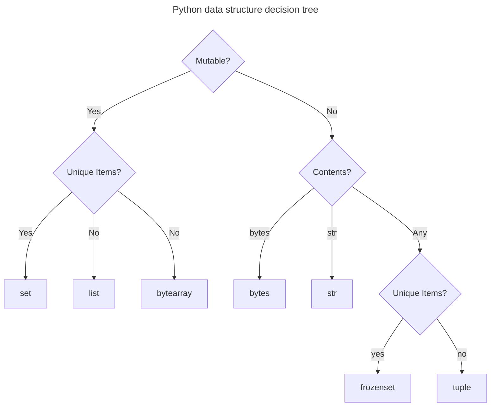

# Data Structures

The following flowchart can be used to identify the most appropriate and efficient data structure when using Python.

```mermaid
---
title: Python data structure decision tree
---
flowchart TB
   mutable{Mutable?}
   mutable -->|Yes| unique_mutable{Unique Items?}
   unique_mutable -->|Yes| set
   unique_mutable -->|No| list & bytearray
   mutable -->|No| contents{Contents?}
   contents -->|bytes| bytes
   contents -->|str| str
   contents -->|Any| unique_immutable{Unique Items?}
   unique_immutable -->|yes| frozenset
   unique_immutable -->|no| tuple
```
